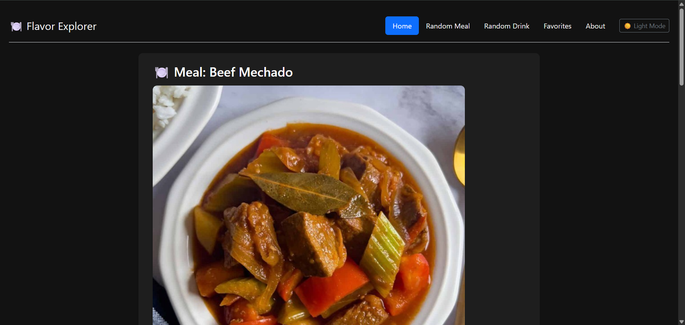

# 🍽️ Flavor Explorer

**Flavor Explorer** is a modern web application built with Node.js and Express that lets users explore random meals and drinks from around the world. It utilizes [TheMealDB API](https://www.themealdb.com/) and [TheCocktailDB API](https://www.thecocktaildb.com/) to fetch curated recipes with images and instructions.

---

## 🌟 Features

- 🔀 Get random meals and drinks with a single click  
- 🌙 Toggle between Dark Mode and Light Mode  
- 💅 Stylish and responsive UI with Bootstrap and custom CSS  
- ♻️ Shuffle button with modern gradient and animation  
- 📱 Mobile-friendly design  

---

## 📸 Preview



---

## 🚀 Tech Stack

- Node.js  
- Express.js  
- EJS (Embedded JavaScript Templates)  
- Bootstrap 5  
- Axios  
- JavaScript (DOM manipulation & theme toggle)

---

## 📂 Project Structure

```
flavor-explorer/
├── public/
│   ├── style/
│   │   └── style.css
│   └── script.js
├── views/
│   ├── index.ejs
│   └── partials/
│       ├── header.ejs
│       └── footer.ejs
├── server.js
├── package.json
└── .gitignore
```

---

## 🔧 Setup Instructions

1. **Clone the repository**
   ```bash
   git clone https://github.com/rahulkumarnaik/Flavor-Explorer
   cd flavor-explorer
   ```

2. **Install dependencies**
   ```bash
   npm install
   ```

3. **Start the server**
   ```bash
   node server.js
   ```

4. **Visit in your browser**  
   Open [http://localhost:3000](http://localhost:3000)

---

## ⚙️ Environment

No API key is required. The project uses public endpoints from TheMealDB and TheCocktailDB.

---

## 📌 Future Enhancements

- Add search functionality for specific meals or drinks
- Enable users to save favorites to local storage
- Add filters like cuisine type or alcohol preference

---

## 📄 License

This project is licensed under the MIT License.

---

## 🙌 Acknowledgments

- [TheMealDB API](https://www.themealdb.com/)
- [TheCocktailDB API](https://www.thecocktaildb.com/)
- [Bootstrap](https://getbootstrap.com/)
